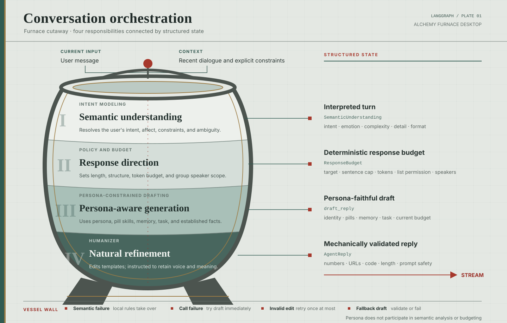

<div align="center">
  

  <h1>Alchemy Furnace · 炼丹炉</h1>

  <p>Give agents a vivid sense of personhood.</p>

  <p>
    <a href="#why-alchemy-furnace">Why Alchemy Furnace</a> ·
    <a href="#what-it-does">What it does</a> ·
    <a href="#conversation-orchestration">Conversation architecture</a> ·
    <a href="#get-started">Get started</a> ·
    <a href="#local-development">Development</a>
  </p>

  <p><a href="README.zh.md">中文</a> · <a href="https://github.com/mindaxis-ai/alchemy-furnace">GitHub</a></p>
</div>

---

## Why Alchemy Furnace

Most agents can complete a task. Far fewer make you feel that there is **someone** on the other side.

Alchemy Furnace explores more than a static character sheet. How can an agent develop recognisable habits of expression, values, knowledge preferences, emotional cadence, and ways of relating? When two—or several—very different personalities are fused, what new individual emerges: one that inherits its sources, but cannot be reduced to their sum?

“A sense of personhood” is not imitation, and it is not a handful of personality labels. It comes from reusable, adjustable language patterns that remain visible across conversations: someone precise and restrained; someone warm, energetic, and relentlessly curious; someone who turns disorder into structure. Alchemy Furnace distils those patterns into composable **Elixir Pills**, which **Dao Agents** can take, collide with, and grow through.

> The question is not whether an agent can resemble a person. It is: when different people meet and influence one another, who might they become?

## What it does

- **Distil language patterns** — Turn a way of speaking, a skill tendency, or a personality trait into a structured Elixir Pill. Write one by hand or use Nuwa Distillation to extract a reviewable draft from source material.
- **Shape Dao Agents** — Give an agent a name, profile, avatar, base personality, model, and pill bindings, then build a conversational identity that can keep evolving.
- **Fuse personalities** — Use weights and order to let multiple pills interact. Fusion is not just joining settings; it is a way to observe how traits coordinate, conflict, and produce something emergent.
- **Talk and hold roundtables** — Develop a one-to-one relationship with an agent, or bring several together around a topic to see their different voices and dynamics.
- **Orchestrate conversation in layers** — Each turn passes through semantic understanding, response direction, persona-aware generation, and natural language refinement. Small questions stay short. Complex tasks receive more room. Persona and pill capabilities shape drafting and voice refinement, but do not participate in intent analysis or length decisions.
- **Validate the final reply** — Humanizer removes stock openings, repeated summaries, forced patterns, and customer-service endings while being instructed to preserve the person's meaning and voice. Deterministic checks cover mechanically verifiable invariants such as numbers, URLs, code, response limits, and prompt leakage before any reply is sent.
- **Keep synthesis traceable** — Pills, bindings, and fusion origins are recorded. Go orchestrates and caches; the Python engine performs structured synthesis and OpenAI-compatible model calls.

## Conversation orchestration



Alchemy Furnace divides reply production into four stages with separate responsibilities. `SemanticUnderstanding` and `ResponseBudget` move through LangGraph as structured state, so the person's model does not have to infer intent, control length, and maintain a persona in the same step.

1. **Semantic understanding** combines the current message with recent dialogue. It identifies intent, task type, affect, explicit constraints, and unresolved ambiguity, then returns a structured semantic result.
2. **Response direction** applies deterministic policy to that result. It sets the target length, hard character and sentence limits, model Token budget, list permission, and group speaker allocation.
3. **Persona-aware generation** produces the substantive answer within that budget. Its prompt context contains the persona, pill capabilities, memory, dialogue examples, established facts, and other information relevant to content generation.
4. **Natural language refinement** uses Humanizer to edit expression under explicit constraints. It is instructed to remove templated openings, forced parallel structures, repeated conclusions, and customer-service closers while retaining facts, position, numbers, URLs, code structure, and the person's own cadence. Final deterministic checks cover only properties the program can verify mechanically.

A normal one-to-one turn usually makes three model calls: semantic understanding, the person's draft, and natural language refinement. The director is deterministic local code and does not add another model call. An open-ended group conversation adds one Supervisor call to choose speakers. Direct mentions, all-member requests, and roll calls use deterministic routing.

If semantic understanding is unavailable, local rules produce the semantic result and response budget. Humanizer output must pass final validation. A returned edit that changes a protected number or URL, breaks a code fence, leaks a prompt, or exceeds the budget is retried at most once. A Humanizer call error skips that retry and immediately attempts the constrained persona draft. The fallback draft is validated too; if it is still unsafe, the turn fails instead of sending it.

People know which pills they have consumed in Alchemy Furnace and answer truthfully when asked. In ordinary conversation, pills supply capabilities and expressive tendencies. They do not make someone identify as a Daoist or default to archaic, cultivation-themed speech.

## Core concepts

| Concept | Meaning |
| --- | --- |
| **Elixir Pill** (金丹) | A structured recipe for a language pattern or capability: an expressive style, a thinking habit, a knowledge preference, or a personality tendency. |
| **Dao Agent** (道人) | The product term for a conversational person with a name, personality, model, and pill bindings. In conversation, they are a specific person speaking as themselves. |
| **Binding** (服丹) | Attaches a pill to an agent and tunes its influence with `weight` (0–10) and `sort_order`. |
| **Synthesis** (合成) | Refines an agent’s base nature and bound pills into the system prompt and behavioural rules used in conversation. |
| **Fusion Pill** (融合金丹) | A new pill distilled from several pills, retaining its source and version history. |

## How it works

```text
Your material, observations, and ideas
                 │
                 ▼
      Distil Elixir Pills ──→ Fuse new possibilities
                 │                       │
                 ▼                       ▼
          Agents take pills ───────→ A distinct personality
                 │
                 ▼
     Conversations / roundtables / observation
```

Alchemy Furnace is a **Wails desktop application**. It runs a Go gateway, Python language engine, and static Next.js UI locally; data is stored in a SQLite file in the user configuration directory by default. Model calls use the OpenAI-compatible endpoint configured in Settings.

## Get started

Download the desktop package for your platform from [GitHub Releases](https://github.com/yusanwen-code/alchemy-furnace/releases):

- macOS Apple Silicon (`darwin-arm64`)
- macOS Intel (`darwin-amd64`)
- Windows x64 (`windows-amd64`)

After launch:

1. Configure a model provider, API key, base URL, and default model in **Settings**.
2. Create or distil an Elixir Pill in the **Elixir Pavilion**.
3. Create a Dao Agent and choose its base personality and pills in the **Daoist Residence**.
4. Start a dialogue or invite several agents to a roundtable in **Discourse**.

API keys are encrypted in the local database. Do not commit `.env`, exported configurations, or logs.

## Local development

### Requirements

- Go (see `backend/go/go.mod`)
- Python 3.11+ and `pip`
- Node.js 20+ and `pnpm`
- Docker Desktop, only when using PostgreSQL or the full Compose development stack

### Quick start

```bash
make init                 # create .env for development/self-hosting
make dev                  # start frontend, Go, Python, and check the database
```

Run services individually when needed:

```bash
make dev-front
make dev-go
make dev-python
```

### Tests, formatting, and desktop packaging

```bash
make test
make format
make desktop-package PLATFORM=darwin-arm64 VERSION=v0.1.0
# PLATFORM: darwin-arm64, darwin-amd64, or windows-amd64
```

The desktop package is the supported product form. The Web UI, `serve` command, and Docker Compose remain available for development, diagnostics, and CI; they are not a separately supported Web or mobile product.

## Repository layout

```text
backend/go/       Go API gateway, Wails entry point, data access, and services
backend/python/   FastAPI language engine, distillation, and LLM calls
frontend/         Next.js + React + Tailwind desktop UI
scripts/          Development, runtime build, desktop packaging, and checks
docs/             Architecture, deployment, operations, and design docs
specs/            Feature specifications and data contracts
```

## Further reading

- [System architecture](docs/architecture.md)
- [Desktop release process](docs/deployment/desktop-release.md)
- [Frontend notes](docs/frontend.md)
- [中文 README](README.zh.md)

## License

This project uses the repository’s [custom license](LICENSE). Personal, educational, and non-commercial use is allowed by default; commercial use requires the author’s prior written approval.

© yusanwen-code · Alchemy Furnace
