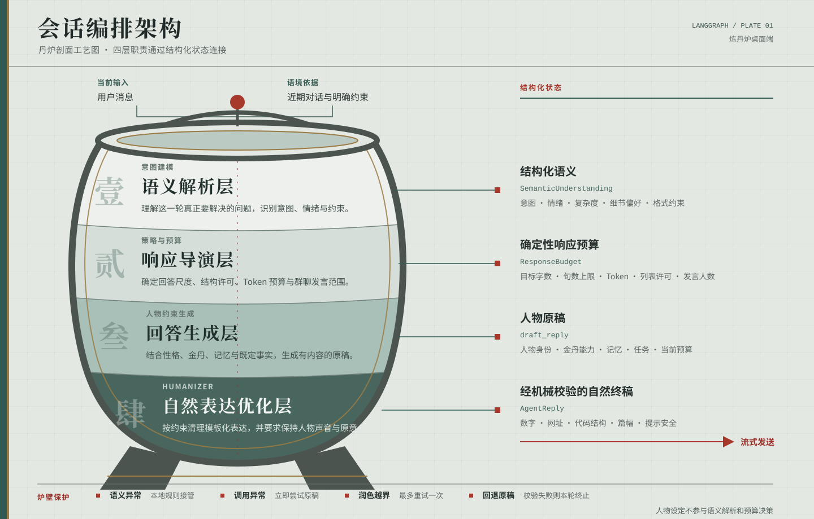

# 炼丹炉 · Alchemy Furnace

> 让 Agent 不止会回答，也像一个正在与你共同生活的人。

[English](README.md) · [GitHub](https://github.com/yusanwen-code/alchemy-furnace)

## 为什么是炼丹炉

大多数 Agent 都能完成任务，却很难让人感到：**眼前真的有一个人**。

炼丹炉想探索的不是一张静态的「人设卡」，而是更难也更有趣的问题：怎样让 Agent 拥有稳定的表达习惯、价值取向、知识偏好、情绪节奏与相处方式；当两个甚至多个截然不同的人格融合时，又会诞生怎样一个既继承来源、又不可被简单相加的新个体？

这里的「活人感」不等于模仿真人，也不等于给模型贴几个性格标签。它来自可复用、可调节、能在对话中持续显露的语言模式：有人克制而敏锐，有人热烈又爱追问，有人擅长把混乱梳理成秩序。炼丹炉把这些模式炼成可组合的「金丹」，交给「道人」服用、碰撞与生长。

> 我们关心的不是 Agent 能不能像人，而是：不同的人相遇、互相影响之后，会成为谁？

## 核心能力

- **炼制语言模式**：把一种表达方式、技能倾向或人格特征沉淀为结构化的「金丹」。你可以手工编写，也可以让女娲智能蒸馏从材料中提炼候选草稿。
- **塑造道人**：为 Agent 配置道号、简介、头像、基础性格、模型与服丹关系，建立可持续演化的对话角色。
- **人格融合**：用权重与顺序让多枚金丹共同作用。融合不只是拼接设定，而是观察不同特质在一个 Agent 身上如何协调、冲突与涌现。
- **对谈与围炉论道**：既可一对一持续相处，也可让多个道人围绕同一主题交谈，直观看见人格差异与融合后的互动。
- **分层会话编排**：每轮对话依次经过语义解析、响应导演、人物回答生成和自然表达优化。小问题会短答，复杂任务才展开；人物性格与金丹能力影响原稿及声音优化，但不参与意图判断和篇幅决策。
- **终稿保真与安全回退**：Humanizer 按要求清理套话、重复总结、机械排比和客服式收尾，同时保持人物原意与声音。发送前的确定性校验只检查程序可机械证明的项目，包括数字、网址、代码、篇幅和提示词泄漏。
- **可追溯的合成**：金丹、服丹与融合来源都有明确记录；Go 负责业务编排与缓存，Python 引擎负责结构化合成和模型调用。

## 对话编排架构



炼丹炉将一次回答拆成四个职责明确的阶段。`SemanticUnderstanding` 与 `ResponseBudget` 作为结构化状态在 LangGraph 中传递，人物模型不需要同时猜测用户意图、控制回答篇幅和维持人物设定。

1. **语义解析层（Semantic Understanding）**：结合当前消息与近期对话，识别意图、任务类型、情绪状态、明确约束及待消除的歧义，输出结构化语义结果。
2. **响应导演层（Response Director）**：根据语义结果执行确定性策略，给出目标字数、字符与句数上限、模型 Token 预算、列表许可，以及群聊中的发言人数和单人配额。
3. **回答生成层（Persona-aware Generation）**：人物模型在响应预算内作答。提示上下文包含人物性格、金丹能力、记忆、示例对白、已经发生的事实，以及其他与内容生成有关的信息。
4. **自然表达优化层（Natural Language Refinement）**：Humanizer 对原稿进行受约束的表达编辑。它被要求减少模板化开场、机械排比、重复总结和客服式收尾，并保持事实、立场、数字、网址、代码结构与人物自己的说话方式；终稿的确定性校验只覆盖程序可以机械验证的属性。

普通单聊每轮通常发起三次模型调用，依次用于语义理解、人物原稿和自然表达优化。导演层由本地确定性规则实现，不额外调用模型。开放式群聊会增加一次 Supervisor 调用，用于规划发言者；明确点名、全体发言与报数等指令使用确定性路由。

语义模型不可用时，系统使用本地规则生成语义结果与响应预算。Humanizer 返回的润色稿如出现数字或网址变化、代码围栏损坏、提示词泄漏或超出篇幅等问题，最多重试一次；若 Humanizer 调用本身异常，则跳过重试，立即尝试受预算约束的人物原稿。回退稿也必须通过校验，否则本轮失败，不会发送不安全文本。

人物知道自己在炼丹炉里服用过哪些金丹。用户直接询问时，他会按记录如实回答；在普通对话中，金丹只提供能力和表达倾向，不会让人物自称道人，也不会自动采用古风或修仙口吻。

## 炼丹炉中的概念

| 概念 | 它是什么 |
| --- | --- |
| **金丹**（Elixir Pill） | 一份结构化的语言模式或能力配方：可以是一种表达风格、思考习惯、知识偏好，或某种人格倾向。 |
| **道人**（Dao Agent） | 炼丹炉对对话人物的产品称呼。人物拥有自己的姓名、性格、模型与金丹关系；进入对话后，他就是一个具体的人。 |
| **服丹**（Binding） | 让道人使用金丹，并以 `weight`（0–10）和 `sort_order` 调整其影响。 |
| **合成**（Synthesis） | 将道人本性与所服金丹炼合为对话时使用的系统提示词和行为规则。 |
| **融合金丹**（Fusion） | 由多枚金丹提炼而来、保留来源与版本信息的新金丹。 |

## 它如何工作

```text
你的材料、观察与想法
          │
          ▼
    提炼为金丹 ──→ 融合为新的可能
          │                    │
          ▼                    ▼
      道人服丹 ───────────→ 形成独特人格
          │
          ▼
   对谈 / 围炉论道 / 继续观察
```

炼丹炉是一个 **Wails 桌面应用**。它在本机运行 Go 网关、Python 语言引擎与 Next.js 静态界面，默认将数据保存到用户配置目录下的 SQLite 文件；模型调用使用你在设置中配置的 OpenAI 兼容接口。

## 开始使用

从 [GitHub Releases](https://github.com/yusanwen-code/alchemy-furnace/releases) 下载适合你的桌面安装包：

- macOS Apple Silicon（`darwin-arm64`）
- macOS Intel（`darwin-amd64`）
- Windows x64（`windows-amd64`）

启动应用后：

1. 在「设置」中配置模型提供商、API Key、Base URL 与默认模型；
2. 在「金丹阁」创建金丹，或从已有材料蒸馏金丹；
3. 在「道人府」创建道人，为它选择性格与服用的金丹；
4. 进入「论道」，开始一场对谈，或邀请多个道人一起围炉。

API Key 会加密保存在本地数据库中。请不要提交 `.env`、导出的配置或日志。

## 本地开发

```bash
make init
make dev
make test
make format
```

环境要求：Go（见 `backend/go/go.mod`）、Python 3.11+、Node.js 20+、`pnpm`；Docker Desktop 仅用于 PostgreSQL 或完整 Compose 开发栈。

桌面安装包是正式产品形态。Web、`serve` 命令与 Docker Compose 仅保留给开发、诊断和 CI，不作为独立 Web 或移动端产品交付。

## 进一步阅读

- [系统架构](docs/architecture.md)
- [桌面发布流程](docs/deployment/desktop-release.md)
- [前端说明](docs/frontend.md)

## 许可证

本项目使用仓库中的 [自定义许可证](LICENSE)。默认允许个人、学习和非商业使用；商业使用需事先获得项目作者书面授权。
